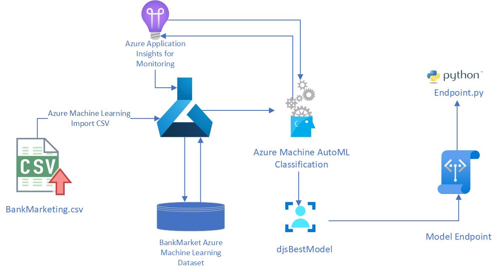
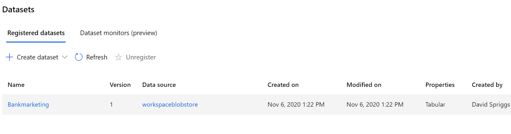
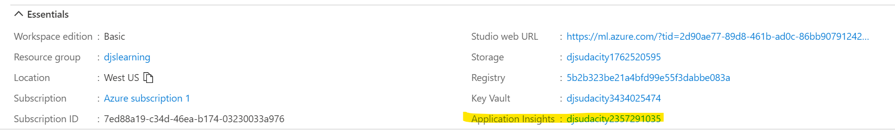

# Bank Marketing

This project is part of the Udacity Azure ML Nanodegree. In this project, our goal is determine the next set of potential customers to which to market. To accomplish this task we are we are building a model then create consumable pipelines. We will use the power of Azure AutoML functionality to determine the potential customer by submitting a data set and AutoML will provide the best model and a consumable endpoint; in this case will use a python script to submit test data and retrieve results from the best model selected.

## Architectural Diagram

## Key Steps
### Ingestion of data
We need to have the data ingested to begin to have the model begin gain insights and train.

### Configuration of a Azure Service Principal
Using the service principal, provides control over which resources can be accessed and at which level. For security reasons, it's always recommended to use service principals with automated tools rather than allowing them to log in with a user identity.

### Configuration of Application Insights
 Application will aid in detecting endpoint and endpoint performance anomalies. 
 

## Screen Recording
Screencast [here](https://youtu.be/m5cNzaCqIII)

## Standout Suggestions
One suggestion is to perform Exploratory Data Analysis on the dataset prior to  running AutoML.
