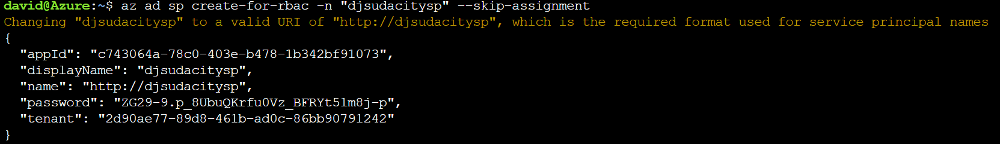

# Bank Marketing

This project is part of the Udacity Azure ML Nanodegree. In this project, our goal is determine the next set of potential customers to which to market. To accomplish this task we are we are building a model then create consumable pipelines. This model is then compared to an Azure AutoML run.

## Architectural Diagram
We start by creating a Azure Service Principal to allow for secure and easy to assets used in this model. 
Next we create a workspace and grant the Service Principal access to the workspace:

Once access is granted we create an AutoML pipeline. The first step is to load the data into a registered data set

Next create an AutoML pipeline and run it. . We enable logging and Application Insights to track the model and determine if any improvements are needed.

Last we set the model up for consumption through deployment:
 And then using Swagger we consume the endpoint to ensure it runs as expected 

## Key Steps
*TODO*: Write a short description of the key steps. Remember to include all the screenshots required to demonstrate key steps. 

## Screen Recording
*TODO* Provide a link to a screen recording of the project in action. Remember that the screencast should demonstrate:

## Standout Suggestions
*TODO (Optional):* This is where you can provide information about any standout suggestions that you have attempted.
